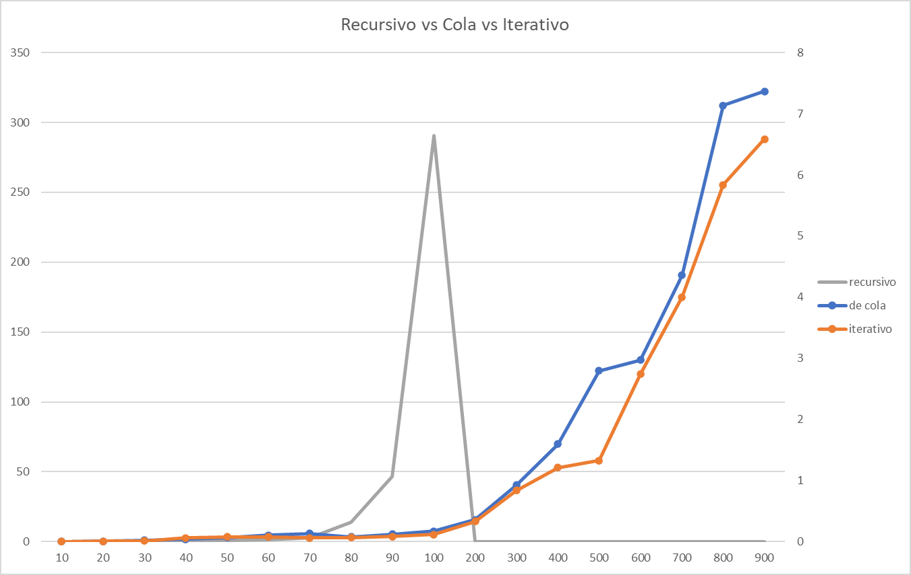
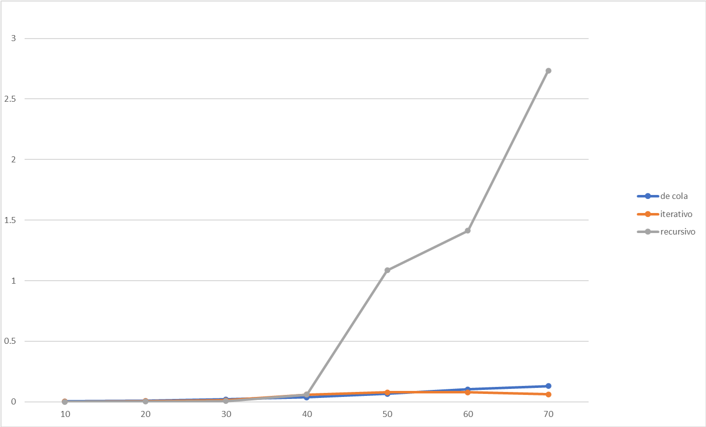
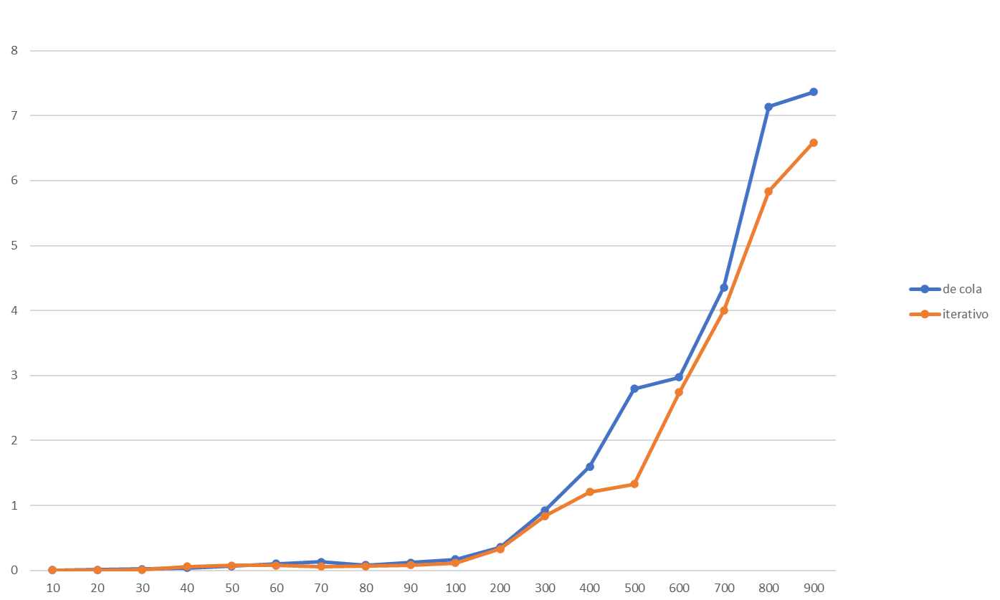

## Análisis Comparativo

**Nota:** Los tiempos a continuación son expresados en segundos.

### 1. Cuadro Comparativo
---
Los tiempos mostrados en el cuadro son el resultado de correr cada algoritmo diez veces y sacar el promedio de los valores obtenidos.

| Valor de n  |      Recursión      | Recursión de cola  | Iteración  | 
|:-----------:|:-------------------:|:------------------:|:-------------------:|
|    **10**   |0.0003034418279474432|0.003337860107421875|0.002297488125887784|
|    **20**   |0.001712278886274858 |0.008084557273171165|0.0063939528031782674|
|    **30**   |0.0065239993008700285|0.02093748612837358 |0.012072649869051847|
|    **40**   |0.059279528531161224 |0.03743171691894531 |0.059582970359108665|
|    **50**   |1.085628162730824    |0.06693059747869318 |0.07854808460582387|
|    **60**   |1.4120448719371448   | 0.10427561673251065|0.07854808460582387|
|    **70**   |2.7354413812810723   |0.1308917999267578  |0.06281245838512074|
|    **80**   |13.786749406294389   |0.07961013100363991 |0.06450306285511363|
|    **90**   |46.609683470292524   |0.12187524275346236 |0.08459524674849077|
|    **100**  |290.69811647588557   |0.16951560974121094 |0.11647831309925426|
|    **200**  |         -           |0.3603154962713068  |0.33096833662553266|
|    **300**  |         -           |0.9248690171675249  |0.8390600031072443|
|    **400**  |         -           |1.8967498432506213  |1.2091289867054333|
|    **500**  |         -           |2.796693281693892   |1.3266476717862217|
|    **600**  |         -           |2.9741200533780185  |2.7414668690074575|
|    **700**  |         -           |4.355734044855291   |3.9980845017866655|
|    **800**  |         -           |7.137168537486684   |5.838047374378551|
|    **900**  |         -           |7.365876978093928   |6.586703387173739|

Se tomó un tiempo máximo de cuatro horas para correr cada algoritmo. Aquellas entradas sin valor son aquellas de las que no se obtuvo respuesta pasado este tiempo.

En nuestra ejecución, tenemos otras funciones recursivas de cola denominada `calculate_tribonacci(n)` y `tribonacci(n)` -Una de ellas llama a la otra-. Es prudente también obtener los tiempos de cálculo de las mismas, ya que son utilizadas en la recursión de cola e iteración.

Dado que antes de $n = 100$ los valores son muy pequeños, lo hacemos en el rango $100 \leq n \leq 900$.

| Valor de n  | `calculate_tribonacci()`|    `tribonacci()`   |
|:-----------:|:-----------------------:|:-------------------:|
|   **100**   |    0.0095367431640625   |0.012159347534179688 |
|   **200**   |    0.30159950256347656  |0.018835067749023438 |
|   **300**   |    0.008106231689453125 |0.021219253540039062 |
|   **400**   |    0.016689300537109375 |0.054836273193359375 |
|   **500**   |    0.015020370483398438 |0.04410743713378906  |
|   **600**   |    0.019550323486328125 |0.06437301635742188  |
|   **700**   |    0.02288818359375     |0.0896453857421875   |
|   **800**   |    0.0171661376953125   |0.07557868957519531  |
|   **900**   |    0.020742416381835938 |0.08034706115722656  |

### 2. Gráficos
---

|  |
| :--: |
| *Comparación de las tres llamadas. Se puede apreciar la gran diferencia entre la llamada recursiva ordinaria y las otras dos.* |

|  |
| :--: |
| *En esta comparación, se tiene un eje secundario del lado derecho. Esto permite una mejor visualización de la recursión de cola y la iteración.* |

|  |
| :--: |
| *Comparación de las tres llamadas hasta $n = 40$. Mientras los valores de n son pequeños, el tiempo entre las tres llamadas (especialmente la recursiva ordinaria y la iterativa) se asemeja.* |

|  |
| :--: |
| *Comparación de las tres llamadas hasta $n = 70$. Podemos notar el momento que la llamada recursiva ordinaria va obteniendo valores mucho más altos que el de las otras.* |

 |
| :--: |
| *Comparación de la llamada recursiva de cola y la llamada iterativa.* |

|  |
| :--: |
| *Comparación de la llamada recursiva de cola, la llamada iterativa y ellas mismas pero restándoles el tiempo de cálculo de tribonacci.* |

### 3. Conclusión
----

Tal y como se puede apreciar, la llamada iterativa y la recursiva de cola producen resultados similares en la mayoría de los casos. En la mayoría de los puntos, la llamada iterativa siempre tiene valores menores.

Como conocemos por lo aprendido en clase, el algoritmo iterativo toma mucho más tiempo que los otros dos ya que debe hacer más de una llamada antes de poder retornar. En nuestro caso, tenemos `return  subrutina_recursiva(n - 4) + subrutina_recursiva(n - 8) + subrutina_recursiva(n - 12)`, lo cual son **tres** llamadas a hacerse antes de retornar.

Mientras el valor de $n$ se mantenga bajo, los tiempos de ejecución de la llamada recursiva ordinaria estarán a la par de las otras dos. Claro está, que esto se debe a que el tiempo de cálculo para las otras tres llamadas que la recursión ordinaria hace también es menor.

Al usar recursión de cola, no se debe esperar por ninguna llamada adicional, lo que hace que los tiempos de espera sean menores.

En clase se vió que los tiempos entre una llamada iterativa que no requería esperar otros valores y una llamada recursiva tradicional eran equitativos. En nuestro caso, la llamada iterativa de cola y la recursiva cumplen con lo mencionado. 

A su vez, como se mencionó en la primera sección, tanto la llamada iterativa como la recursión de cola utilizan la función `calculate_fibonacci()`, la cual también afecta en el tiempo de ejecución de ambas. Sin embargo, como se pudo notar en los gráficos anteriores, no es una diferencia tan grande como para ser notoria.